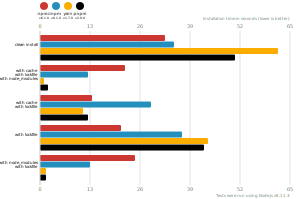

# Node package manager benchmark

This benchmark compares the performance of [npm](https://github.com/npm/npm), [pnpm](https://github.com/pnpm/pnpm) and [yarn](https://github.com/yarnpkg/yarn).

## React app

The app's `package.json` [here](./fixtures/react-app/package.json)

| action  | cache | lockfile | node_modules| npm ci | npm | Yarn | pnpm |
| ---     | ---   | ---      | ---         | --- | --- | --- | --- |
| install |       | ✔        |             | 32.5s | 34.8s | 1m 1.8s | 50.6s |
| install | ✔    | ✔        | ✔           | 22.2s | 12.4s | 1.1s | 2s |
| install | ✔    | ✔        |             | 13.6s | 28.8s | 11.1s | 12.4s |
| install |      | ✔        |             | 21s | 37s | 43.7s | 42.6s |
| install |      | ✔        | ✔           | 24.8s | 13.1s | 1.5s | 1.6s |

